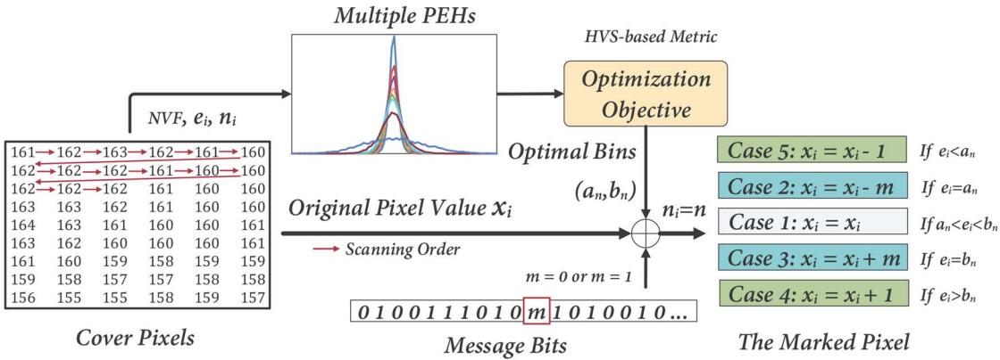
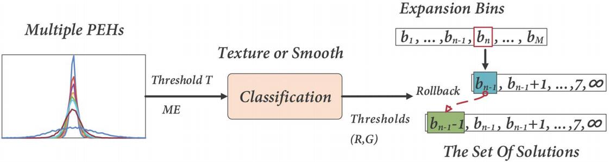
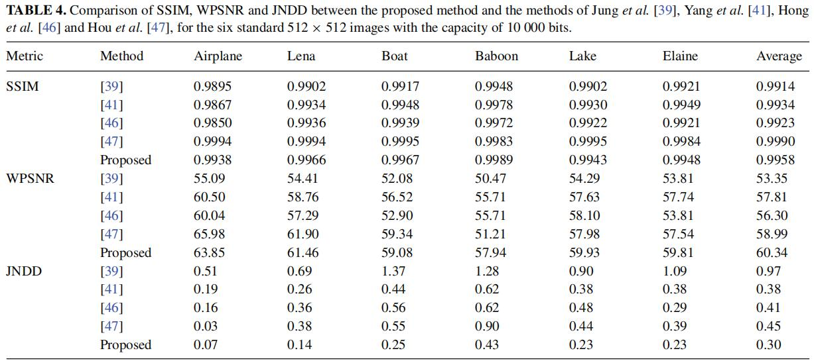
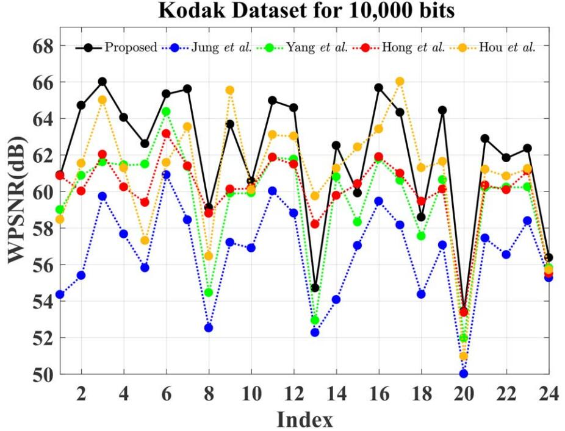
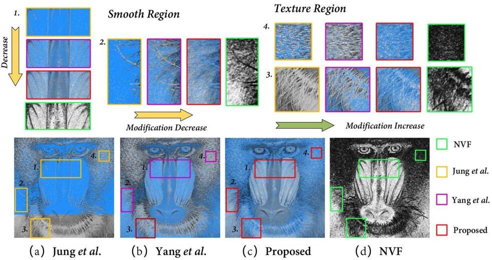

HVS based RDH
=======


This repo is implementation for the accepted paper "[Human Visual System Guided Reversible Data Hiding Based On Multiple Histograms Modification](https://academic.oup.com/comjnl/article/66/4/888/6503940)" (TCJ 2023).


<p align="center">     </p>
<p align="center"> Figure 1: The framework of data embedding in the proposed method. </p>


<p align="center">     </p>
<p align="center"> Figure 2: The framework of the rollback mechanism in the proposed method. </p>


## How to run

### Basic method 

```
run main.m 
```

## Experimental Results

<p align="center">     </p>
<p align="center"> Figure 2: Comparison of SSIM, WPSNR and JNDD. </p>

<p align="center">     </p>
<p align="center"> Figure 3: WPSNR comparison on the database of Kodak for an embedding capacity of 10,000 bits.</p>

<p align="center">     </p>
<p align="center"> Figure 4: Comparison of the modification. </p>


## Environment
Matlab 2016b <br>


## Acknowledgement
This work was supported by the National Science Foundation of China (Nos. 61872128, 61972031, U1736213).


## Citation
If you find this work useful for your research, please cite
```
@ARTICLE{9605567,
  author={Zhang, Cheng and Ou, Bo and Li, Xiaolong and Xiong, Jianqin},
  journal={The Computer Journal}, 
  title={Human Visual System Guided Reversible Data Hiding Based On Multiple Histograms Modification}, 
  year={2023},
  volume={66},
  number={4},
  pages={888-906},
  doi={10.1093/comjnl/bxab203}}
```

## License and Copyright
The project is open source under MIT license (see the ``` LICENSE ``` file).

